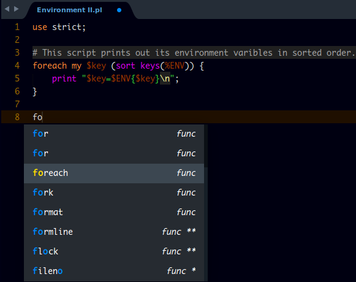

# Perl Completions

A Sublime text package that displays several completions for the PERL language methods

## Usage
Normal typing of method names shows methods for modules.

> **Note** that the amount of * displayed next ot the func specifies how many arguments the function takes.

## Installation
> Important: You need to have `Package Control` installed first on your sublime text which can be found at [The Package Contol Website](http://packagecontrol.io)

### Using Package Control's Repository

Go to `Preferences` --> `Package Control` --> `Add Repository` --> then type into the textbox `https://github.com/tushortz/Perl-Completions`

After doing this, then go to: `Preferences` --> `Package Control` --> `Install Package` --> then search `Perl-Completions` and click it.

The package will be installed and ready for use.

### Using Git

Locate your Sublime Text `Packages` directory by using the menu item `Preferences -> Browse Packages...`.

While inside the `Packages` directory, clone the theme repository using the command below:

    git clone https://github.com/tushortz/Perl-Completions

or just download the zipped folder, extract it and paste the extracted folder into your sublime text packages directory.

## Contributing

All contributions are welcome. fork Perl Completions on [Github](https://github.com/tushortz/Perl-Completions) and create a pull request. Any suggestions or bugs, please let me know.

## Licence

© 2016 Taiwo Kareem | taiwo.kareem36@gmail.com.

**Read license.txt**

## Acknowledgements
I'd first like to say a very big thank you to God my creator. Without him, this wouldn't be possible.